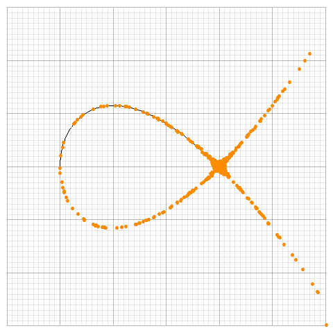
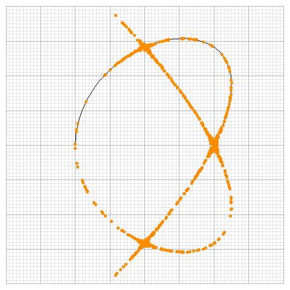

# rust-bezier-implicitize

A module enables converting explicit bezier representation into implicit bezier representation for any high dimention in the efficient way (see the reference). 

 

## Usage
This is still a work in progress, for over 4-dimentional bezier curve this is not efficient as the paper propose, for it's using naive Bezout resultant.

Requires nalgebra(0.31.1~).

## References
[Curve implicitization using moving lines - Sederberg et al.]()